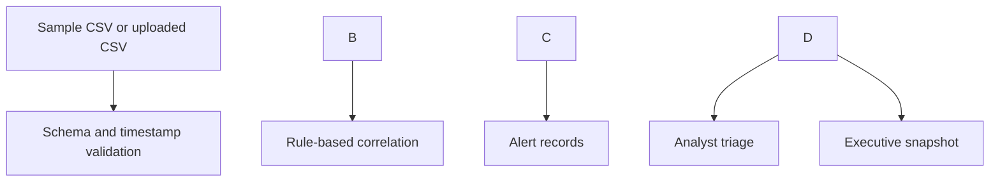

# SOC Executive Dashboard

A Python portfolio project that turns **synthetic security events** into rule-based alerts and two views: an analyst triage table and an executive operational snapshot. It demonstrates detection logic, alert prioritization, and communication of security activity to leadership.


\## Dashboard Preview


!\[SOC Executive Dashboard](images/soc-dashboard.png)

## Quick start

```bash
python -m venv .venv
# macOS/Linux: source .venv/bin/activate
# Windows PowerShell: .venv\\Scripts\\Activate.ps1
pip install -r requirements.txt
streamlit run app.py
```

The app opens locally in a browser. It loads `data/sample\_events.csv` by default; upload your own CSV in the sidebar using the same column names. Do not upload real sensitive logs to a public repository.

## What it detects

|Rule|Trigger|Severity|Analyst follow-up|
|-|-|-|-|
|Failed login burst|At least five failures from one IP against one user in ten minutes|High|Check identity logs and source context|
|Successful login after failures|A success from that IP/user within ten minutes after a detected burst|Critical|Validate the account and session promptly|
|Reported phishing|A phishing event marked `reported`|Medium|Review message and recipient exposure|
|Blocked malware|A malware event marked `blocked`|Medium|Confirm containment and look for related activity|

Failure threshold and time window are adjustable in the sidebar. These examples are detection leads, not proof of compromise. The sample IPs use documentation-only address ranges.

## Data flow



Required CSV columns: `timestamp` (ISO 8601), `event\_id` (unique), `source\_ip`, `target\_user`, `target\_system`, `event\_type`, `outcome`. The included sample provides 14 events and produces five alerts at the default settings.

## Leadership interpretation

The executive view shows volume, severity, targeted users, and a timeline. It flags the highest priority activity and states a suggested next action. The analyst view shows underlying event IDs so detections can be traced back to source records. Counts for investigations, false positives, escalations, MTTD/MTTR, vulnerability trends, endpoint coverage, and risk scores are deliberately omitted until data exists to calculate them honestly.

## Limitations and next steps

This is a local demonstration with synthetic data. It is not a live SIEM, threat intelligence feed, incident management platform, or validated detection program. A next iteration could add persistent cases and analyst dispositions, de-duplication across longer data sets, asset context, and measured response times.

## Test

```bash
python -m unittest discover -s tests -v
```

